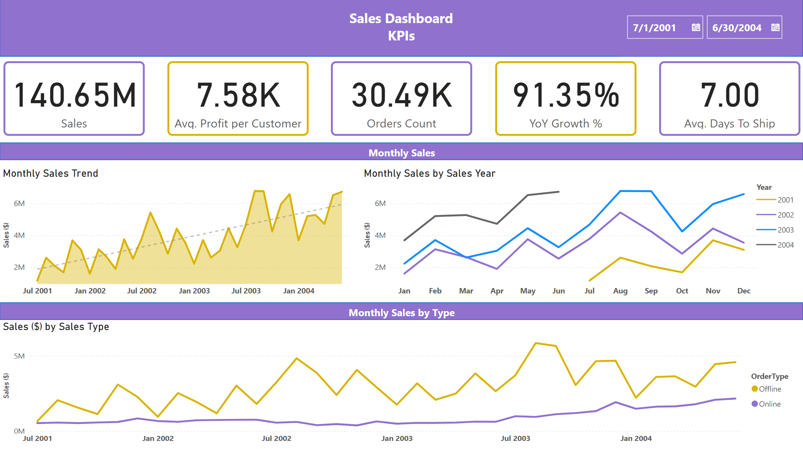
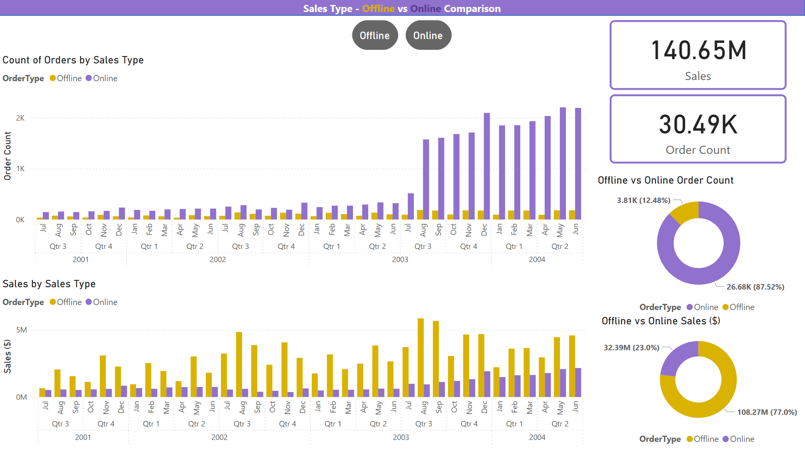
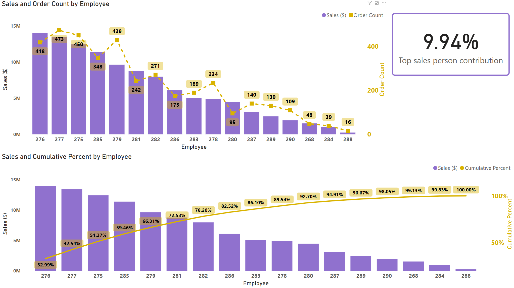
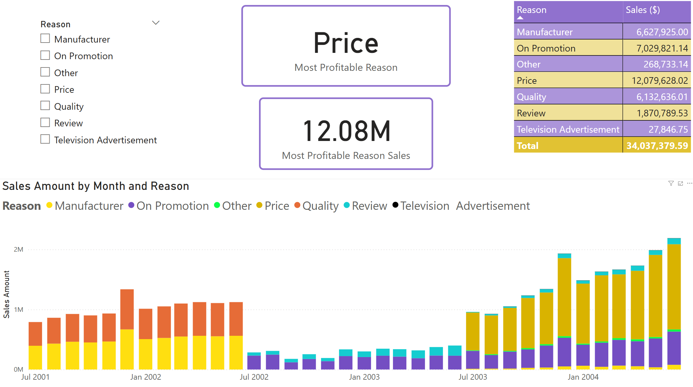
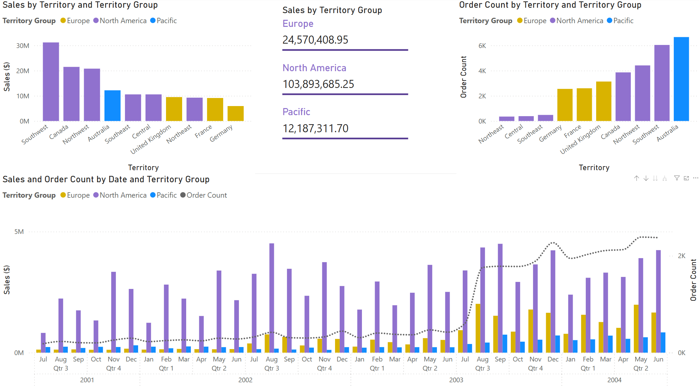
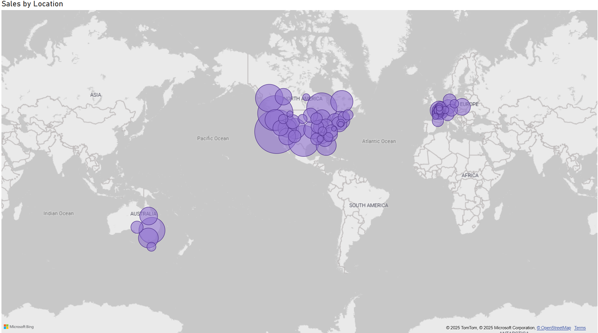
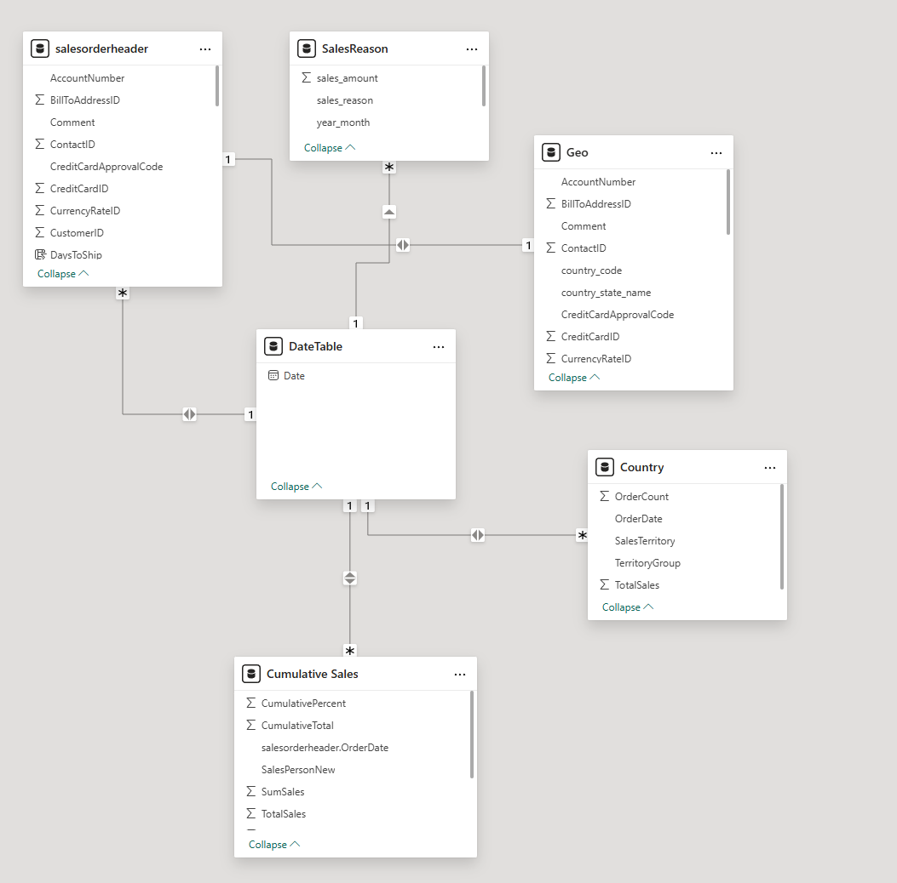

# AdventureWorks Sales Performance Dashboard - Power BI Project

## ℹ️ Overview

This project involves the enhancement and refinement of a Power BI sales dashboard for the fictional company AdventureWorks. The primary goal was to improve the existing dashboard's visual appeal, clarity, interactivity, and to incorporate new, valuable business insights based on the AdventureWorks dataset. This dashboard aims to provide a clear and user-friendly tool for analyzing sales performance across various dimensions.

## 📊 Dashboard Showcase

### 1. Main KPIs & Sales Overview
This initial view provides a high-level snapshot of key sales performance indicators, overall sales trends, and a breakdown of sales by type over time.

* **Key KPIs:** Sales, Avg. Profit per Customer, Orders Count, YoY Growth %, Avg. Days To Ship.
* **Trends:** Monthly Sales Trend (with moving average), Monthly Sales by Sales Year, and Monthly Sales by Order Type.

### 2. Sales Type Comparison (Offline vs. Online)
This section allows for a direct comparison of sales performance between Offline and Online channels, looking at order counts and sales values over time, as well as overall contribution.

* Interactive toggle for Offline/Online focus.
* Trends for Order Count and Sales ($) by Sales Type.
* Donut charts summarizing overall Sales and Order Count distribution.

### 3. Sales Person Performance Analysis
This view focuses on individual sales person contributions, highlighting top performers and overall sales distribution using a Pareto analysis.

* Sales ($) and Order Count by Employee.
* Pareto chart showing cumulative sales percentage by Sales Person.
* KPI for "Top sales person contribution %".

### 4. Sales Reason Analysis
Understanding the drivers behind sales, this section breaks down sales amounts by attributed reasons.

* Interactive slicer for "Reason."
* KPIs for "Most Profitable Reason" and its sales value.
* Breakdown table of Sales ($) by Reason.
* Stacked bar chart showing Sales Amount by Month and Reason.

### 5. Geographical Sales Performance (Territory & Country)
This section provides insights into sales performance across different geographical territories and countries.

* Breakdowns of Sales ($) and Order Count by Territory Group.
* Detailed sales figures for each Territory Group.
* Combined trend analysis of Sales ($) and Order Count by Date and Territory Group.

### 6. Global Sales Distribution Map
A world map view visualizing sales volume by location, with bubble size representing the sales amount.

## ⚙️ Technical Details

* **Data Source:** AdventureWorks Database.
* **Data Extraction:** Custom SQL queries were written to extract and prepare the necessary data. (SQL queries are documented and provided for in the `queries.sql` file).
* **Tools Used:** Microsoft Power BI Desktop, SQL.

### Data Model
To ensure clarity and analytical depth, the dashboard utilizes a **star schema** data model. 
* The central `salesorderheader` table holds the core sales transactions.
* Dimensions like `DateTable` and `Geo` provide contextual attributes for slicing and dicing the data.
* Supporting this core structure are tables tailored for specific insights, such as `Cumulative Sales` for performance tracking and `Country`-level aggregations, creating a well-rounded view of business operations.
This model is optimized for Power BI's performance and allows for intuitive exploration of sales data.

## 💡 Key Enhancements & Added Value

* **New KPIs Introduced:** Added "Average Profit Per Customer," "Year-Over-Year Growth %," and "Average Days To Ship" for a more comprehensive business overview.
* **Improved Pareto Analysis:** Implemented a clear Pareto chart for validating sales person contributions.
* **Enhanced Interactivity & User Experience:** Addressed filter consistencies and improved overall dashboard navigation and clarity.
* **Color Theme & Accessibility:** Updated color scheme with consideration for branding and color-blind users.

## ⚠️ How to View the Dashboard

*To explore the full interactive dashboard, please download the `.pbix` file from this repository and open it using Microsoft Power BI Desktop.*

*Note: The `assets/` folder is intended for project-related images.*

## 👤 Author

* Laisvis Remeikis
* 🔗 [LinkedIn](https://www.linkedin.com/in/laisvisr/)
---
